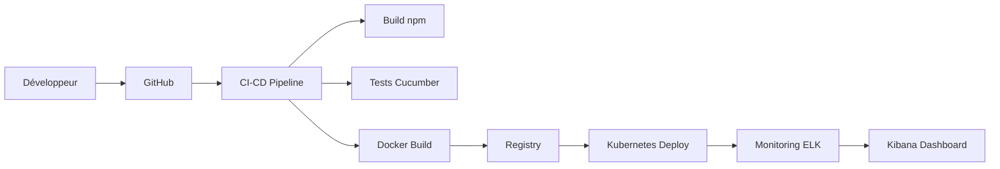
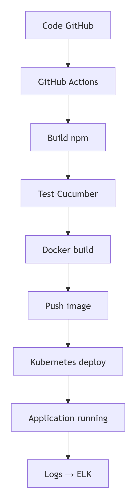

# 🏭 Projet Usine Logicielle – DevOps

## 🎯 Objectif du projet

Ce projet a pour objectif de concevoir, mettre en œuvre et présenter une **usine logicielle fonctionnelle** permettant d’automatiser le cycle de vie d’une application web.

L’objectif principal est de démontrer une chaîne complète allant :

```bash
du dépôt Git → jusqu’au déploiement automatisé
```

tout en intégrant :

- ✅ automatisation (CI/CD)
- ✅ qualité logicielle (tests)
- ✅ sécurité (DevSecOps)
- ✅ supervision (monitoring)

---

## 🧾 Contexte

Une entreprise spécialisée dans le développement d’applications web souhaite industrialiser ses pratiques DevOps.

### 🔴 Situation actuelle

- Builds et déploiements manuels ❌
- Tests non systématiques ❌
- Environnements hétérogènes ❌
- Sécurité insuffisante ❌
- Supervision limitée ❌

### 🟢 Objectif

Mettre en place une **usine logicielle complète**, couvrant tout le cycle de vie applicatif :

```bash
Développement → Intégration → Livraison → Déploiement → Supervision
```

---

## 🧭 Vue globale de l’architecture



---

## 🧩 Stack technique

| Domaine | Outil | Rôle | Justification |
|----------|-------|------|---------------|
| Planification | Trello | Gestion des tâches | Visualisation Kanban, collaboration, suivi de projet |
| Développement | Vscode, GitHub | IDE et gestion de version | Développement, versioning, collaboration |
| Build | npm | Gestion des dépendances | Automatisation du build, gestion des packages |
| Tests | Cucumber | Tests fonctionnels | Automatisation des tests, BDD |
| Conteneurisation | Docker | Conteneurisation des applications | Isolation, portabilité, déploiement |
| Orchestration | Kubernetes | Déploiement et gestion des conteneurs | Scalabilité, haute disponibilité, gestion des ressources |
| Déploiement | GitHub Actions, Ansible | Automatisation du déploiement | CI/CD, automatisation des tâches |
| Supervision | ELK Stack (Elasticsearch, Logstash, Kibana) | Monitoring et visualisation des logs | Collecte, analyse et visualisation des logs |

---

## 🔄 Fonctionnement de l’usine logicielle

### 📌 Workflow global

<p align="center">
  

---

## ⚙️ Détail des étapes

### 1. 💻 Développement

- Codage avec Visual Studio Code
- Versioning du code avec GitHub
- Collaboration via Pull Requests

### 2. 🔄 Intégration continue (CI)

- Installation des dépendances
- Build de l’application
- Exécution des tests automatisés avec Cucumber

### 3. 🚀 Livraison continue (CD)

- Création de l’image Docker
- Publication de l’image dans un registry
- Déploiement via Kubernetes

### 4. 📦 Déploiement

- Automatisation avec Ansible
- Gestion et orchestration des conteneurs avec Kubernetes

### 5. 📊 Monitoring

- Centralisation des logs avec ELK (Elasticsearch, Logstash, Kibana)
- Visualisation et analyse via Kibana

---

## 🧪 Qualité logicielle

- Tests automatisés avec Cucumber
- Validation à chaque pipeline CI
- Détection précoce des anomalies
- Amélioration continue de la qualité du code

---

## 🔐 Sécurité (DevSecOps)

- Isolation des applications via Docker
- Centralisation des logs pour audit et traçabilité
- Pipeline CI/CD contrôlé et sécurisé
- Réduction des risques liés aux erreurs humaines

---

## 📦 Livrables

Les éléments suivants sont fournis dans le cadre du projet :

- [ ] Code source versionné et accessible via GitHub
- [ ] Pipeline CI/CD entièrement fonctionnel
- [ ] Application conteneurisée avec Docker
- [ ] Déploiement automatisé via Kubernetes et Ansible
- [ ] Monitoring configuré avec la stack ELK
- [ ] Documentation complète du projet (README)