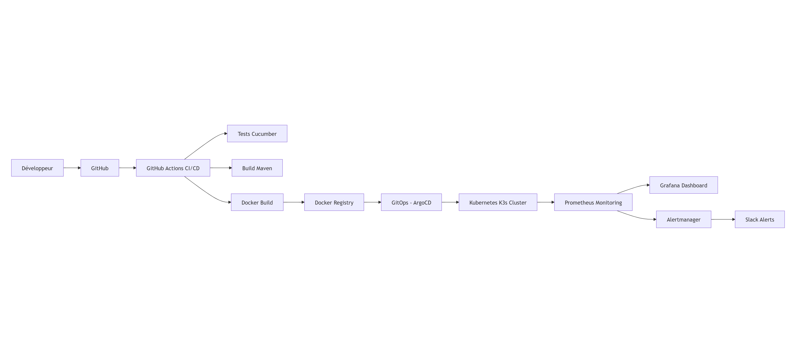

# 🏭 Projet Usine Logicielle – DevOps & DevSecOps

## 🎯 Objectif du projet

Ce projet a pour objectif de concevoir, déployer et superviser une **usine logicielle moderne complète** basée sur les principes DevOps et DevSecOps.

L'objectif est de démontrer un cycle de vie entièrement automatisé :

```bash
Git → CI/CD → Docker → Kubernetes → GitOps → Monitoring → Alerting

```

tout en intégrant :

- ✅ automatisation (CI/CD)
- ✅ qualité logicielle (tests)
- ✅ sécurité (DevSecOps)
- ✅ supervision (monitoring)

---

## 🧾 Contexte

Une entreprise spécialisée dans le développement d’applications web souhaite industrialiser ses pratiques DevOps.

### 🔴 Situation actuelle

- Builds et déploiements manuels ❌
- Tests non systématiques ❌
- Environnements hétérogènes ❌
- Sécurité insuffisante ❌
- Supervision limitée ❌

### 🟢 Objectif

Mettre en place une **chaîne DevOps complète automatisée** :

```bash
Développement → Intégration → Build → Sécurité → Déploiement → Supervision → Alerting
```

---

## 🧭 Vue globale de l’architecture



---

## 🧩 Stack technique

| Domaine | Outil | Rôle | Justification |
|----------|-------|------|---------------|
| Planification | Trello | Gestion des tâches | Visualisation Kanban, collaboration, suivi de projet |
| Développement | Vscode, GitHub | IDE et gestion de version | Développement, versioning, collaboration |
| Build | npm | Gestion des dépendances | Automatisation du build, gestion des packages |
| Tests | Cucumber | Tests fonctionnels | Automatisation des tests, BDD |
| Conteneurisation | Docker | Conteneurisation des applications | Isolation, portabilité, déploiement |
| Orchestration | Kubernetes | Déploiement et gestion des conteneurs | Scalabilité, haute disponibilité, gestion des ressources |
| Déploiement (phase 1) | GitHub Actions, Ansible | Automatisation du déploiement | CI/CD, automatisation des tâches |
| GitOps (phase 2) | ArgoCD | Déploiement GitOps | Automatisation du déploiement, synchronisation avec le dépôt Git |
| Monitoring | Prometheus | Collecte de métriques | Surveillance des performances, alerting |
| Visualisation | Grafana | Visualisation des métriques | Tableaux de bord, alerting |
| Alerting | Alertmanager + Slack | Notifications d’alerte | Alertes en temps réel, communication d’incidents |

---

## 🔄 Fonctionnement de l’usine logicielle

### 📌 Pipeline CI/CD

```bash
Push Git → CI déclenchée :
   → Tests Cucumber
   → Scan Gitleaks
   → Scan Hadolint
   → OWASP Dependency Check
   → Build Maven
   → Docker build & push
   → Scan Trivy
   → Update manifest Kubernetes
```

---

## ⚙️ Déploiement GitOps

- ArgoCD surveille le repository Git
- Détection automatique des changements
- Déploiement Kubernetes automatisé

```bash
git push → ArgoCD détecte → déploie → cluster mis à jour
```

---

## 🚀 Kubernetes

Cluster :

- K3s multi-node
- NodePort / LoadBalancer (MetalLB)
- Déploiement via manifest YAML

---

## 📊 Monitoring & Observability

### ✅ Prometheus

- Collecte métriques cluster
- Collecte métriques applications

### ✅ Grafana

- Dashboards :
  - CPU / RAM
  - Pods
  - Nodes
  - Applications

---

## 🚨 Alerting

### Alertmanager

- Détection événements critiques :
- CPU élevé
- Crash de pods
- erreurs applicatives

### Slack

Exemple d’alerte :

```bash
🚨 ALERT: High CPU Usage
Pod: app-java
Namespace: default
```

## 🧪 Qualité logicielle

- Tests automatisés avec Cucumber
- Validation à chaque pipeline CI
- Feedback rapide
- Amélioration continue de la qualité du code

---

## 🔐 Sécurité (DevSecOps)

- Isolation des applications via Docker
- Centralisation des logs pour audit et traçabilité
- Pipeline CI/CD contrôlé et sécurisé
- Réduction des risques liés aux erreurs humaines

---

## 🔐 DevSecOps

### ✅ Sécurité pipeline

- Gitleaks → secrets
- Trivy → vulnérabilités Docker
  - Dependency Check → dépendances

### ✅ Sécurité infra

- Isolation Docker
- Contrôle accès Kubernetes

---

## 📦 Livrables

Les éléments suivants sont fournis dans le cadre du projet :

- [ ] Code source GitHub
- [ ] Pipeline CI/CD complet
- [ ] Image Docker publiée
- [ ] Déploiement Kubernetes automatisé
- [ ] GitOps avec ArgoCD
- [ ] Monitoring (Prometheus + Grafana)
- [ ] Alerting (Slack)
- [ ] Documentation complète

---

## 🚀 Perspectives d’évolution

🔹 Ingress + HTTPS (cert-manager)
🔹 Horizontal Pod Autoscaler (HPA)
🔹 Logs centralisés (ELK / Loki)
🔹 Tracing distribué (Jaeger)
🔹 Multi-environnements (dev / staging / prod)
