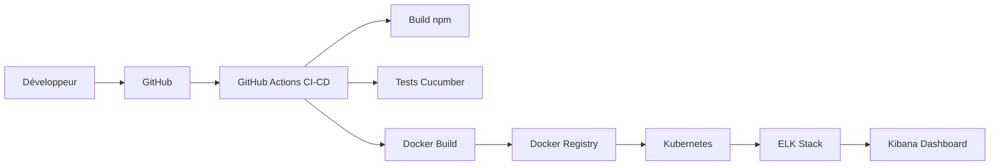
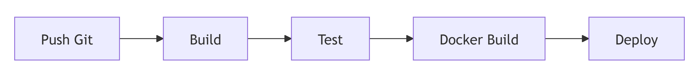
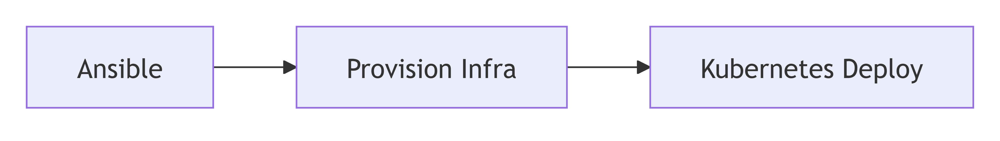
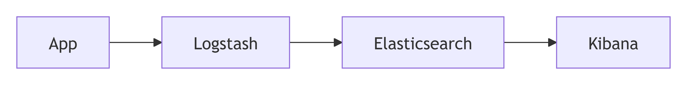

# 🏭 Usine Logicielle – Choix de la stack d’outils

## 🎯 Objectif

Mettre en place une **usine logicielle DevOps complète** permettant de :

- Automatiser le cycle de vie applicatif
- Garantir la qualité logicielle
- Sécuriser les livraisons
- Faciliter le déploiement et la supervision

---

## 🧭 Vue globale de l’architecture



---

## ⚙️ 🧩 Stack d’outils

### 📋 1. Planification : Trello

#### ✅ Justification

- Visualisation des tâches sous forme de tableaux Kanban
- Collaboration simple entre les membres de l’équipe
- Adapté aux méthodologies Agile (Scrum / Kanban)
- Suivi rapide de l’avancement du projet
- Facilité d’utilisation (prise en main rapide)

#### 📊 Rôle dans l’usine logicielle

Trello intervient en amont du cycle de vie applicatif pour organiser et piloter le projet :

```bash
Backlog → En cours → Terminé
```

---

### 💻 2. Développement : VSCode + GitHub

#### ✅ Visual Studio Code

- Éditeur léger et extensible
- Support multi-langages
- Intégration Git native


#### ✅ GitHub

- GVersioning du code
- Collaboration équipe
- Déclencheur des pipelines CI/CD

---

### 🏗️ 3. Build : npm

#### ✅ Justification

- Gestion des dépendances JavaScript
- Standard de l’écosystème Node.js
- Permet un build reproductible

#### 🔁 Fonction

```bash
npm install
npm run build
```

---

### 🧪 4. Tests : Cucumber

#### ✅ Justification

- Tests en langage naturel (BDD)
- Compréhensible par les métiers
- Favorise collaboration dev + QA

#### ✅ Exemple

```gherkin
Scenario: Accès page d'accueil
  Given utilisateur accède à "/"
  Then la page répond 200
```

---

### 🚀 5. CI/CD : GitHub Actions

#### ✅ Justification

- Intégré à GitHub
- Automatisation complète
- Pipeline as code

#### 🔄 Pipeline



---

### 📦 6. Conteneurisation : Docker

#### ✅ Pourquoi Docker ?

- Standard industrie
- Environnement reproductible
- Isolation des applications

#### 📊 Rôle

```bash
Code → Image Docker → Déploiement
```

---

### ☸️ 7. Orchestration : Kubernetes

#### ✅ Justification

- Gestion avancée des containers
- Scalabilité automatique
- Haute disponibilité

#### 📦 Fonctionnalités clés

- Pods
- Services
- Scaling

---

### 🚀 8. Déploiement : Ansible + Kubernetes

#### ✅ Ansible

- Automatisation des déploiements
- Infrastructure as Code (IaC)
- Sans agent

#### ✅ Kubernetes

- Déploiement continu
- Rolling updates

#### 🔁 Workflow



---

### 📊 9. Monitoring : ELK Stack

#### 📦 Stack

- Elasticsearch → stockage
- Logstash → collecte
- Kibana → visualisation

#### 📈 Schéma monitoring



#### ✅ Pourquoi ELK ?

- Centralisation des logs
- Analyse en temps réel
- Dashboard visuel
- Debug simplifié

---

## 🔒 Sécurité intégrée (DevSecOps)

### ✅ Points de contrôle

- Scan des dépendances
- Validation pipeline CI
- Isolation via Docker
- Logs centralisés

---

## ⚡ Pipeline complet


---

### 👨‍💻 Auteurs

- **Joseph DELNORD** – Ingénieur DevOps
- **Guillaume PATTI** – Architecte Cloud